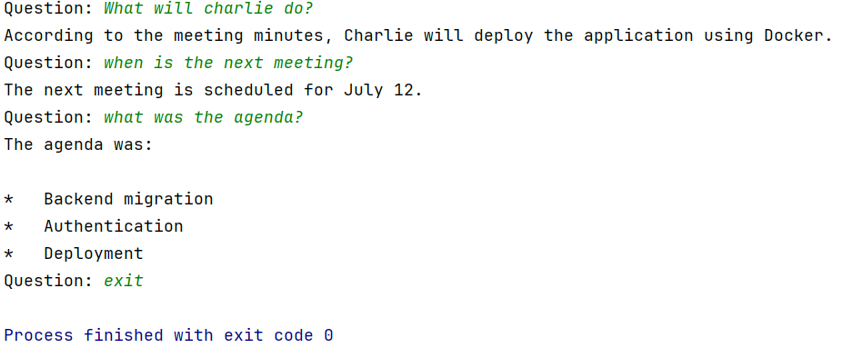

# AI Meeting Minutes Assistant

An AI-powered assistant that answers questions about meeting minutes using **LangChain** and **Ollama**. The assistant loads meeting minutes from a text file, answers questions strictly based on the provided content, and maintains conversation history for contextual follow-up questions.

---

## Features

- Load meeting minutes from a text file
- Answer questions using only the meeting content
- Prevents hallucinations by avoiding assumptions
- Maintains conversation history
- Uses local Gemma models through Ollama
- Modular LangChain architecture

---

## Technologies

- Python
- LangChain
- Ollama
- Gemma 4B
- RunnableWithMessageHistory

---

## Project Structure

```text
AI-METMIN-ASSISTANT/
│
├── documents/
│   └── meeting.txt
│
├── images/
│   └── demo.png
│
├── app.py
├── chains.py
├── prompts.py
├── loaders.py
├── memory.py
├── requirements.txt
├── .gitignore
└── README.md
```

---

## Demo

### Conversation Example



Example:

```text
Question: What will Charlie do?

Charlie will deploy the application using Docker.

Question: What about Alice?

Alice will complete the migration before July 20.

Question: When is the next meeting?

The next meeting is scheduled for July 12.

Question: exit
```

---

## How It Works

```text
Meeting File
      │
      ▼
TextLoader
      │
      ▼
ChatPromptTemplate
      │
      ▼
RunnableWithMessageHistory
      │
      ▼
ChatOllama (Gemma 4B)
      │
      ▼
AI Response
```

---

## Installation

### 1. Clone the repository

```bash
git clone git@github.com:srihasithaa/AI-METMIN-ASSISTANT.git
cd AI-METMIN-ASSISTANT
```

### 2. Create a virtual environment

```bash
python -m venv .venv
```

### 3. Activate the virtual environment

**Windows**

```bash
.venv\Scripts\activate
```

**Linux / macOS**

```bash
source .venv/bin/activate
```

### 4. Install dependencies

```bash
pip install -r requirements.txt
```

### 5. Install Ollama

Download and install Ollama from:

https://ollama.com/download

### 6. Pull the Gemma model

```bash
ollama pull gemma3:4b
```

---

## Running the Application

```bash
python app.py
```

---

## Example Interaction

```text
Question: What will Charlie do?

Charlie will deploy the application using Docker.

Question: What about Alice?

Alice will complete the migration before July 20.

Question: exit
```

---

## Concepts Implemented

- ChatOllama
- ChatPromptTemplate
- Document Loaders
- Runnable Sequence
- RunnableWithMessageHistory
- InMemoryChatMessageHistory
- MessagesPlaceholder

---

## Future Improvements

- Support PDF meeting minutes
- Support multiple meeting files
- Add vector databases
- Implement Retrieval-Augmented Generation (RAG)
- Build a Streamlit web interface
- Add source citations

---

## License

This project is intended for learning and educational purposes.